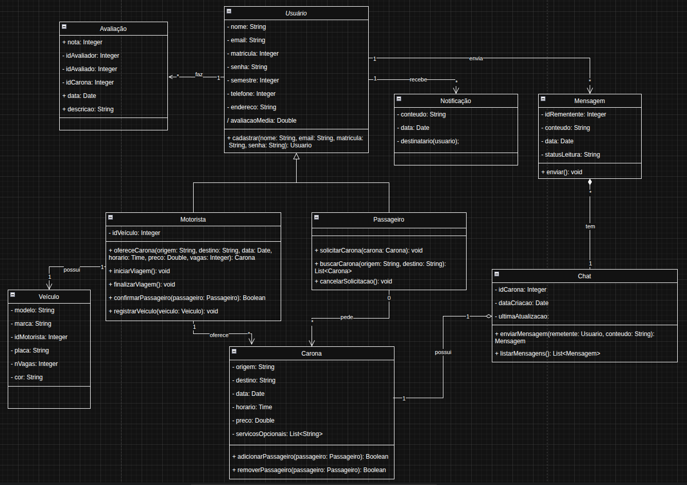

# 2.1. Módulo Notação UML – Modelagem Estática

---

## 2.1.1 Introdução
A Modelagem Estática tem como objetivo representar a estrutura estática de um sistema, ou seja, os elementos que o compõem e as relações entre eles, sem considerar o comportamento dinâmico durante a execução. Esse tipo de modelagem é fundamental para compreender a arquitetura do sistema e estabelecer uma visão clara de como seus componentes se organizam.

Entre os diagramas utilizados nessa abordagem estão o Diagrama de Classes e o Diagrama de Componentes.

- O **Diagrama de Classes** descreve as classes que formam o sistema, seus atributos, métodos e os relacionamentos existentes, fornecendo uma visão detalhada da estrutura interna do software.

- O **Diagrama de Componentes**, por sua vez, apresenta a organização e a dependência entre os diferentes módulos ou partes do sistema, enfatizando a arquitetura de alto nível e como os elementos interagem para compor a solução.

Assim, a Modelagem Estática contribui tanto para a documentação quanto para a compreensão do sistema, servindo como base para o desenvolvimento e a manutenção do software.

## 2.1.2 Metodologia

Para a realização das modelagens, a nossa equipe do projeto **CaronaAmiga** foi dividida em três grupos, cada um composto por três integrantes. Desde o início, ficou definido que seriam produzidos **dois diagramas para cada modelagem** (Estática, Dinâmica e Organizacional). Assim, todos os grupos elaboraram, de forma independente, **os dois diagramas correspondentes a cada tipo de modelagem**, utilizando a ferramenta [Draw.Io](https://www.drawio.com/), e  realizaram uma revisão interna dos diagramas criados pelos seus membros.

Na etapa seguinte, cada grupo ficou responsável pela **unificação de cada diagrama produzido dentro de uma modelagem específica atribuída**, de modo a consolidar uma versão final representativa. Além disso, cada grupo foi encarregado da **documentação da sua respectiva modelagem** e da **revisão do documento produzido por outro grupo**, assegurando consistência, qualidade e padronização no trabalho.

Asssim, neste documento, referente à Modelagem Estática, o Grupo 1 foi responsável pela unificação dos diagramas e pela documentação completa desta modelagem.

A divisão geral ocorreu da seguinte forma:

 Tabela 1 - Divisão de Responsabilidades 

| **Grupo**   | **Responsabilidade**                                                                                                                                                     | **Integrantes**                                      |
| ----------- | ------------------------------------------------------------------------------------------------------------------------------------------------------------------------ | ---------------------------------------------------- |
| **Grupo 1** | Elaborar os dois diagramas de todas as modelagens; unificar os dois diagramas da **Modelagem Estática**; documentar essa modelagem; revisar o documento do Grupo 2       | [Kaleb Macedo](https://github.com/kalebmacedo), [Lucas Monteiro Freitas](https://github.com/LucasMF1) e [Othavio Bolzan](https://github.com/bolzanMGB). |
| **Grupo 2** | Elaborar os dois diagramas de todas as modelagens; unificar os dois diagramas da **Modelagem Dinâmica**; documentar essa modelagem; revisar o documento do Grupo 3       | [Amanda Cruz](https://github.com/mandicrz), [Arthur Sousa](https://github.com/Tutzs) e [Cauã Araujo](https://github.com/caua08)                      |
| **Grupo 3** | Elaborar os dois diagramas de todas as modelagens; unificar os dois diagramas da **Modelagem Organizacional**; documentar essa modelagem; revisar o documento do Grupo 1 | [Caio Venâncio](https://github.com/caio-venancio), [Caio Melo](https://github.com/CaioMelo25), [Maria Eduarda](https://github.com/pyramidsf) e [Pedro Henrique](https://github.com/pedro-hsf)|

<b>Fonte: </b>Autoria de <a href="https://github.com/bolzanMGB">Othavio Bolzan</a>

### 2.1.3 Diagrama de Classes
### 2.1.3.1 Componentes e notação
No diagrama de classes, são utilizados os seguintes elementos da UML:

1. **Classes**: representadas por retângulos divididos em três seções:
    - **Nome da classe**: centralizado na seção superior;
    - **Atributos**: variáveis ou propriedades da classe, listadas na seção do meio;
    - **Métodos**: comportamentos ou funções da classe, listados na seção inferior;

2. **Relacionamentos entre classes**:
    - **Associação**: indica vínculo ou uso entre classes. Representada por uma linha sólida. 
        Exemplo: Passageiro participa de Carona.
    - **Agregação**: representa uma relação “todo-parte”, em que a parte pode existir independentemente do todo. Representada por um losango vazio na extremidade do todo.
        Exemplo: Carona possui Passageiro.
    - **Composição**: similar à agregação, mas a parte não pode existir sem o todo. Representada por um losango preenchido na extremidade do todo.
        Exemplo: Motorista possui Veículo.
    - **Generalização (herança)**: indica que uma classe especializada herda atributos e métodos de uma classe genérica. Representada por uma linha com triângulo na extremidade apontando para a classe pai.
        Exemplo: Motorista e Passageiro herdam de Usuario.

4. **Multiplicidades**: definem a cardinalidade das relações entre classes, indicando quantas instâncias de uma classe podem estar associadas a instâncias de outra.
  Exemplo: Uma Carona pode ter 0..* passageiros; um Motorista possui 1 veículo.

5. **Enumerações**: utilizadas para representar estados, categorias ou valores fixos possíveis de um atributo.
  Exemplo: StatusCarona (Pendente, Confirmada, Cancelada).

### 2.1.3.2 Diagrama de Classes Final

 Tabela 2 - Diagrama de Classes Final 

<b>Fonte: </b>Autoria de <a href="https://github.com/kalebmacedo">Kaleb Macedo</a>, <a href="https://github.com/LucasMF1">Lucas Monteiro Freitas</a> e <a href="https://github.com/bolzanMGB">Othavio Bolzan</a>

### 2.1.3.4 Diagramas de Classes Individuais 

  
Grupo 1

 Tabela 3 - Diagrama de Classes Grupo 1

<b>Fonte: </b>Autoria de <a href="https://github.com/kalebmacedo">Kaleb Macedo</a>, <a href="https://github.com/LucasMF1">Lucas Monteiro Freitas</a> e <a href="https://github.com/bolzanMGB">Othavio Bolzan</a>

  
Grupo 2

 Tabela 4 - Diagrama de Classes Grupo 2

<b>Fonte: </b>Autoria de <a href="https://github.com/mandicrz">Amanda Cruz</a>, <a href="https://github.com/Tutzs">Arthur Sousa</a> e <a href="https://github.com/caua08">Cauã Araújo</a>

  
Grupo 3

 Tabela 5 - Diagrama de Classes Grupo 3

<b>Fonte: </b>Autoria de <a href="https://github.com/caio-venancio">Caio Venâncio</a>, <a href="https://github.com/pyramidsf">Maria Eduarda</a>, <a href="ttps://github.com/CaioMelo25">Caio Melo</a> e <a href="https://github.com/pedro-hsf">Pedro Henirique</a>

### 2.1.4 Diagrama de Componentes
### 2.1.4.1 Componentes e notação

No Diagrama de Componentes, foram adotadas as notações padrão da UML para representar a arquitetura do sistema e as interações entre seus módulos. Os principais elementos utilizados são:

1. **Componentes:** representados por retângulos com a estereotipação <<component>> ou por um ícone específico que simboliza um módulo de software. Cada componente representa uma unidade funcional do sistema.
Exemplos: App Passageiro, App Motorista, API Gateway.

2. **Interfaces:** definem os contratos de comunicação entre os componentes.

3. **Oferecidas:** representadas por conectores “lollipop” (círculo na extremidade do componente), indicando que o componente disponibiliza determinados serviços.

4. **Requeridas:** representadas por conectores “socket” (semicírculo na extremidade), indicando que o componente depende de serviços fornecidos por outro.

5. **Dependências:** indicadas por setas tracejadas, mostram que um componente consome ou utiliza serviços de outro componente.
Exemplo: o App Passageiro depende do API Gateway para consultar informações de caronas.

6. **Camadas:** a disposição hierárquica dos componentes no diagrama evidencia a separação em camadas do sistema, facilitando a compreensão da arquitetura.
Exemplo: camada de apresentação (Apps), camada de aplicação (APIs e serviços) e camada de infraestrutura (Banco de Dados, Servidores).

### 2.1.4.2 Diagrama de Componentes Final

 Tabela 6 - Diagrama de Componentes final

<b>Fonte: </b>Autoria de <a href="https://github.com/kalebmacedo">Kaleb Macedo</a>, <a href="https://github.com/LucasMF1">Lucas Monteiro Freitas</a> e <a href="https://github.com/bolzanMGB">Othavio Bolzan</a>

### 2.1.4.4 Diagramas de Componentes Individuais 

  
Grupo 1

 Tabela 7 - Diagrama de Componentes Grupo 1

<b>Fonte: </b>Autoria de <a href="https://github.com/kalebmacedo">Kaleb Macedo</a>, <a href="https://github.com/LucasMF1">Lucas Monteiro Freitas</a> e <a href="https://github.com/bolzanMGB">Othavio Bolzan</a>

  
Grupo 2

 Tabela 8 - Diagrama de Componentes Grupo 2

<b>Fonte: </b>Autoria de <a href="https://github.com/mandicrz">Amanda Cruz</a>, <a href="https://github.com/Tutzs">Arthur Sousa</a> e <a href="https://github.com/caua08">Cauã Araújo</a>

  
Grupo 3

 Tabela 9 - Diagrama de Componentes Grupo 3

<b>Fonte: </b>Autoria de <a href="https://github.com/caio-venancio">Caio Venâncio</a>, <a href="ttps://github.com/CaioMelo25">Caio Melo</a> <a href="https://github.com/pyramidsf">Maria Eduarda</a> e <a href="https://github.com/pedro-hsf">Pedro Henirique</a>

### 2.1.5 Conclusão
A modelagem estática possibilitou representar de forma clara e organizada a estrutura do sistema, abrangendo tanto o domínio do problema, por meio do Diagrama de Classes, quanto a arquitetura lógica, por meio do Diagrama de Componentes. Esses modelos contribuíram para melhorar a comunicação entre os membros da nossa equipe, forneceram um guia consistente para o desenvolvimento e permitiram validar se os requisitos de negócio foram corretamente contemplados, garantindo uma base sólida para a implementação e manutenção do sistema.

### 2.1.6 Referências
> SERRANO, Milene. Arquitetura e Desenho de Software – Aula: Modelagem UML Estática. Universidade de Brasília, 2025. Disponível em: https://aprender3.unb.br/pluginfile.php/3178533/mod_page/content/1/Arquitetura%20e%20Desenho%20de%20Software%20-%20Aula%20Modelagem%20UML%20Estática%20-%20Profa.%20Milene.pdf

### 2.1.7 Histórico de Versão

| Versão | Data       | Descrição                                    | Autor                                          | Revisor |
| :----: | ---------- | -------------------------------------------- | ---------------------------------------------- | ------- |
|  `1.0` | 20/09/2025 | Criação da estrutura do Documento            | [Othavio Bolzan](https://github.com/bolzanMGB) |         |
|  `1.1` | 20/09/2025 | Criação da Introdução                        | [Kaleb Macedo](https://github.com/kalebmacedo) |         |
|  `1.2` | 20/09/2025 | Criação da Metodologia                       | [Lucas Monteiro](https://github.com/LucasMF1)  |         |
|  `1.3` | 20/09/2025 | Criação do módulo Diagrama de Classes        | [Kaleb Macedo](https://github.com/kalebmacedo) |         |
|  `1.4` | 20/09/2025 | Criação do módulo Diagrama de Componentes    | [Othavio Bolzan](https://github.com/bolzanMGB) |         |
|  `1.5` | 20/09/2025 | Criação do Conclusão                         | [Lucas Monteiro](https://github.com/LucasMF1)  |         |
|  `1.6` | 20/09/2025 | Padronização ABNT das referências utilizadas | [Kaleb Macedo](https://github.com/kalebmacedo) |         |

