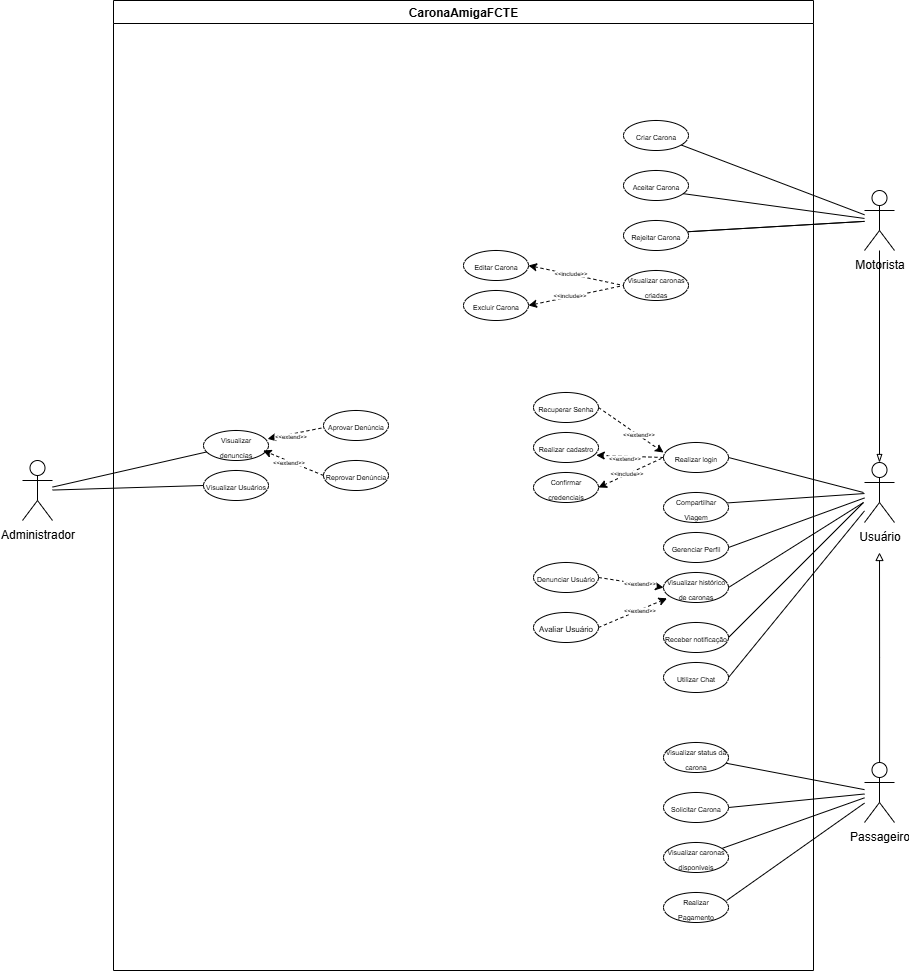
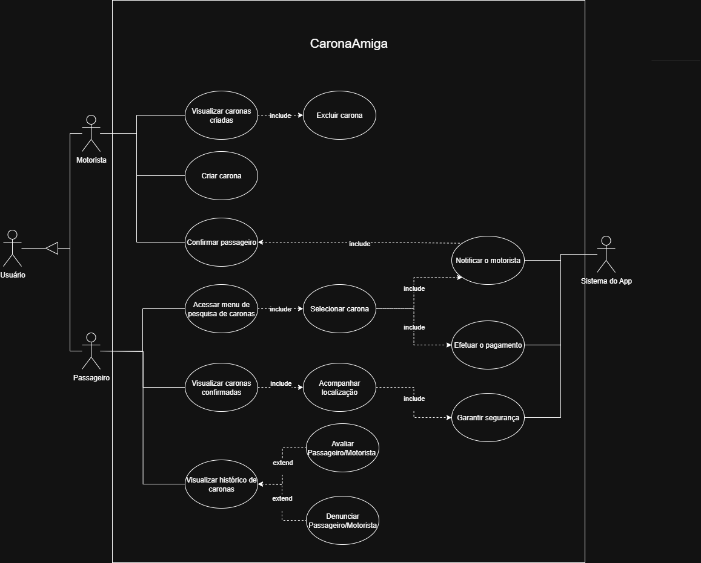
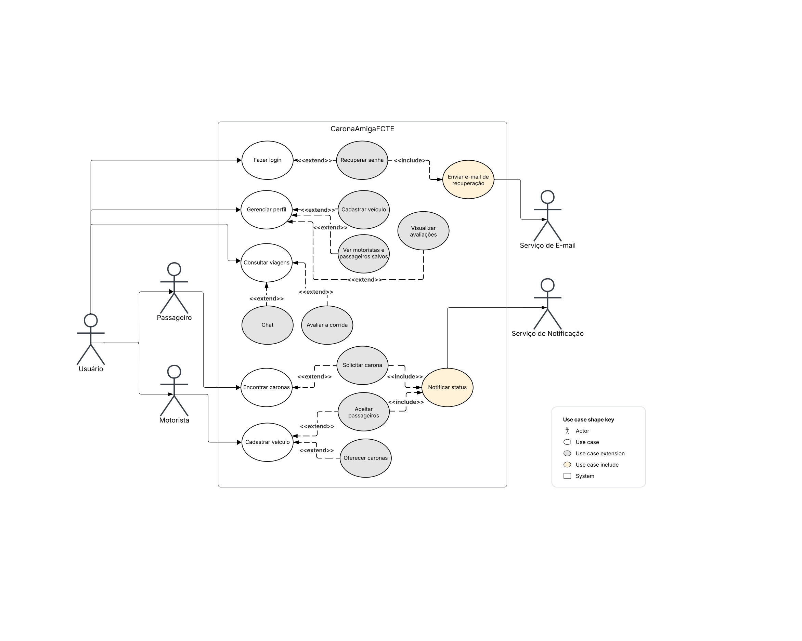
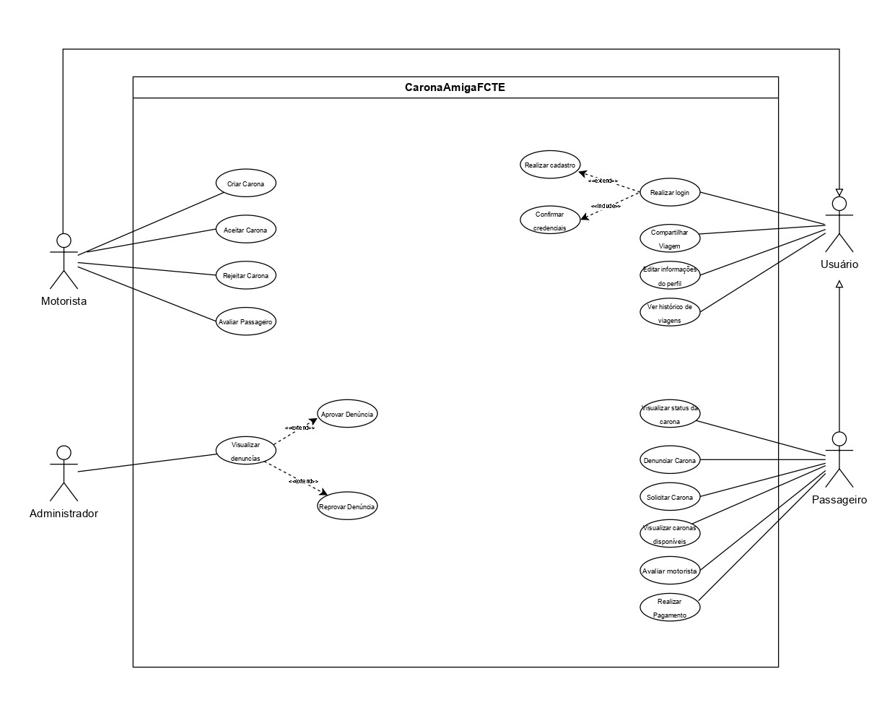
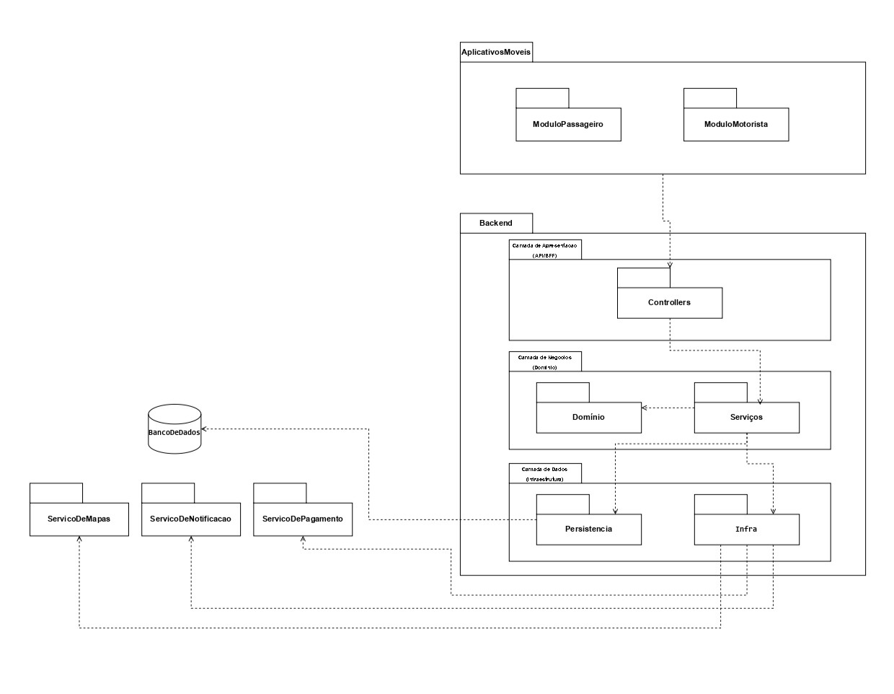
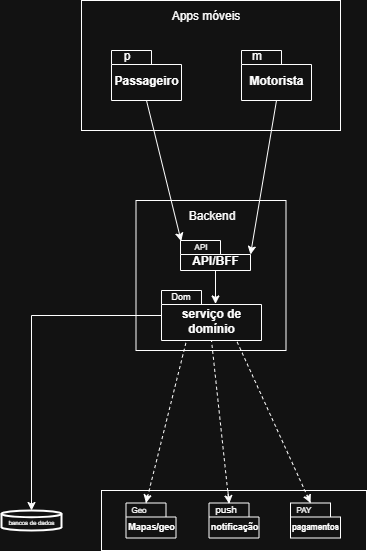
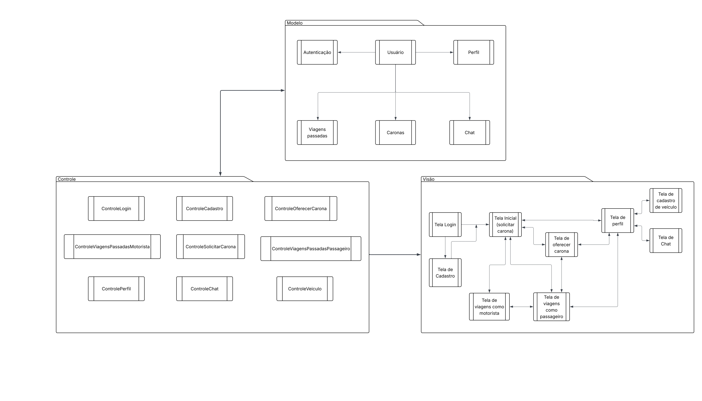
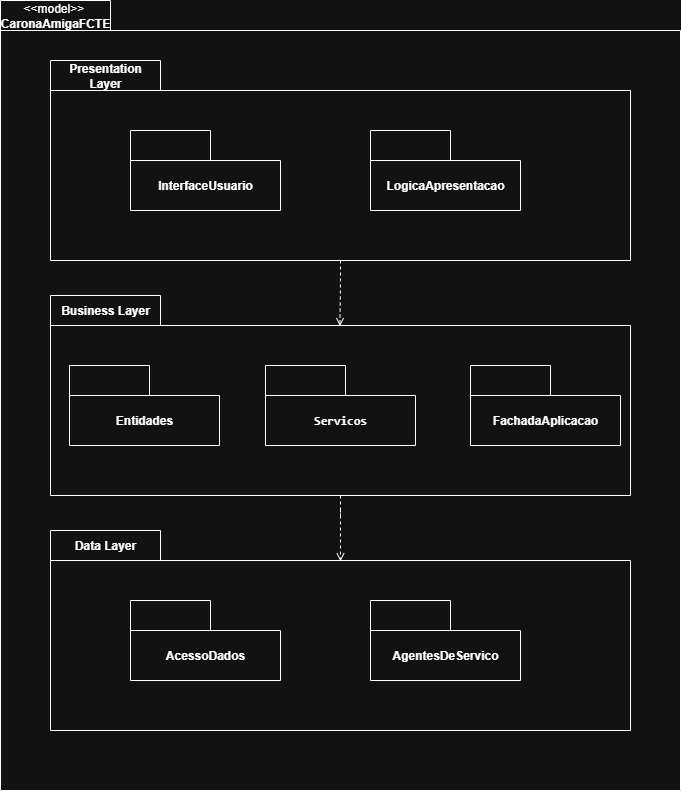

# 2.3. Módulo Notação UML – Modelagem Organizacional e Casos de Uso

<!-- Foco_3: Modelagem Organizacional OU Casos de Uso.

Entrega Mínima: 1 Modelo, sendo esse o Diagrama de Pacotes ou o Diagrama de Casos de Uso.

Apresentação (para a professora) explicando o modelo especificado, com: (i) rastro claro aos membros participantes (MOSTRAR QUADRO DE PARTICIPAÇÕES & COMMITS); (ii) justificativas & senso crítico sobre o modelo, e (iii) comentários gerais sobre o trabalho em equipe. Tempo da Apresentação: +/- 5min. Recomendação: Apresentar diretamente via Wiki ou GitPages do Projeto. Baixar os conteúdos com antecedência, evitando problemas de internet no momento de exposição nas Dinâmicas de Avaliação.

A Wiki ou GitPages do Projeto deve conter um tópico dedicado ao Módulo Modelagem Organizacional/Casos de Uso (Notação UML), com 1 modelo, histórico de versões, referências, e demais detalhamentos gerados pela equipe nesse escopo. -->

## 2.3.1 Introdução

O **diagrama de casos de uso** é um dos diagramas comportamentais mais importantes da UML, fundamental na fase de levantamento de requisitos. Ele representa as funcionalidades do sistema da perspectiva do usuário, mostrando as interações entre atores e casos de uso. Em sistemas maiores, essas funcionalidades são frequentemente organizadas com o auxílio do **diagrama de pacotes**, que agrupa casos de uso em subsistemas lógicos. Juntos, eles se concentram em definir o que o sistema faz, e não em como faz, servindo como um contrato inicial que define o escopo do projeto de maneira estruturada.

## 2.3.2 Metodologia

Para a realização das modelagens, a nossa equipe do projeto **CaronaAmiga** foi dividida em três grupos, cada um composto por três integrantes. Desde o início, ficou definido que seriam produzidos **dois diagramas para cada modelagem** (Estática, Dinâmica e Organizacional). Assim, todos os grupos elaboraram, de forma independente, **os dois diagramas correspondentes a cada tipo de modelagem**, utilizando a ferramenta [Draw.Io](https://www.drawio.com/), e  realizaram uma revisão interna dos diagramas criados pelos seus membros.

Na etapa seguinte, cada grupo ficou responsável pela **unificação de cada diagrama produzido dentro de uma modelagem específica atribuída**, de modo a consolidar uma versão final representativa. Além disso, cada grupo foi encarregado da **documentação da sua respectiva modelagem** e da **revisão do documento produzido por outro grupo**, assegurando consistência, qualidade e padronização no trabalho.

Assim, neste documento, referente à Modelagem Organizacional, o Grupo 3 foi responsável pela unificação dos diagramas e pela documentação completa desta modelagem.

A divisão geral ocorreu da seguinte forma:

| **Grupo**   | **Responsabilidade**                                                                                                                                                     | **Integrantes**                                      |
| ----------- | ------------------------------------------------------------------------------------------------------------------------------------------------------------------------ | ---------------------------------------------------- |
| **Grupo 1** | Elaborar os dois diagramas de todas as modelagens; unificar os dois diagramas da **Modelagem Estática**; documentar essa modelagem; revisar o documento do Grupo 2       | [Kaleb Macedo](https://github.com/kalebmacedo), [Lucas Monteiro Freitas](https://github.com/LucasMF1) e [Othavio Bolzan](https://github.com/bolzanMGB). |
| **Grupo 2** | Elaborar os dois diagramas de todas as modelagens; unificar os dois diagramas da **Modelagem Dinâmica**; documentar essa modelagem; revisar o documento do Grupo 3       | [Amanda Cruz](https://github.com/mandicrz), [Arthur Sousa](https://github.com/Tutzs) e [Cauã Araujo](https://github.com/caua08)                      |
| **Grupo 3** | Elaborar os dois diagramas de todas as modelagens; unificar os dois diagramas da **Modelagem Organizacional**; documentar essa modelagem; revisar o documento do Grupo 1 | [Caio Venâncio](https://github.com/caio-venancio), [Caio Melo](https://github.com/CaioMelo25), [Maria Eduarda](https://github.com/pyramidsf) e [Pedro Henrique](https://github.com/pedro-hsf)|

## 2.3.3 Diagrama de Casos de Uso

### 2.3.3.1 Componentes e Notação do Diagrama de Casos de Uso

| Componente / Notação | Símbolo / Representação | Descrição |
| :--- | :--- | :--- |
| **Ator** | Figura de boneco palito | Representa um papel desempenhado por um usuário, outro sistema ou entidade externa que interage com o sistema. |
| **Caso de Uso** | Elipse | Representa uma funcionalidade específica que o sistema executa para entregar um resultado de valor a um ator. |
| **Associação** | ------ (linha sólida) | Conecta um ator a um caso de uso, indicando que o ator participa daquela funcionalidade. |
| **Limite do Sistema** | retângulo | Caixa que delimita o escopo do sistema, separando os casos de uso (internos) dos atores (externos). |
| **Relacionamento <<include>>** | <------ (seta tracejada) | Indica que um caso de uso **obrigatoriamente** inclui a funcionalidade de outro. Ajuda a reutilizar comportamentos comuns. |
| **Relacionamento <<extend>>** | <------ (seta tracejada) | Indica que um caso de uso pode, **opcionalmente**, estender o comportamento de outro em um ponto específico. |
| **Generalização** | ───▷ (seta com triângulo vazio) | Indica uma relação de herança entre atores ou entre casos de uso, onde um é uma versão especializada do outro. |

### 2.3.3.2 Diagrama de Casos de Uso Unificado

 Imagem 1 - Diagrama de Casos de Uso Unificado 

<b>Fonte: </b>Autoria de <a href="https://github.com/caio-venancio">Caio Venâncio</a>, <a href="https://github.com/pyramidsf">Maria Eduarda</a>, <a href="ttps://github.com/CaioMelo25">Caio Melo</a> e <a href="https://github.com/pedro-hsf">Pedro Henrique</a>

### 2.3.3.3 Diagrama de Casos de Uso Individuais

  
Grupo 1

 Imagem 2 - Diagrama de Classes Grupo 1

<b>Fonte: </b>Autoria de <a href="https://github.com/kalebmacedo">Kaleb Macedo</a>, <a href="https://github.com/LucasMF1">Lucas Monteiro Freitas</a> e <a href="https://github.com/bolzanMGB">Othavio Bolzan</a>

  
Grupo 2

 Imagem 2 - Diagrama de Classes Grupo 2

<b>Fonte: </b>Autoria de <a href="https://github.com/mandicrz">Amanda Cruz</a>, <a href="https://github.com/Tutzs">Arthur Sousa</a> e <<a href="https://github.com/caua08">Cauã Araújo</a>

  
Grupo 3

 Imagem 3 - Diagrama de Classes Grupo 3

<b>Fonte: </b>Autoria de <a href="https://github.com/caio-venancio">Caio Venâncio</a>, <a href="https://github.com/pyramidsf">Maria Eduarda</a>, <a href="ttps://github.com/CaioMelo25">Caio Melo</a> e <a href="https://github.com/pedro-hsf">Pedro Henirique</a>

## 2.3.4 Diagrama de Pacotes

### 2.3.4.1 Componentes e Notação do Diagrama de Pacotes

| Componente / Notação | Símbolo / Representação | Descrição |
| :--- | :--- | :--- |
| **Pacote** | Retângulo com uma aba menor no topo | Representa um namespace ou um agrupador para organizar elementos do modelo (como classes, casos de uso ou outros pacotes). Ajuda a gerenciar a complexidade do sistema. |
| **Elemento Contido** | Símbolo do elemento (classe, componente, etc.) dentro do pacote | Representa um membro que pertence ao pacote. A visibilidade do membro (+ público, - privado) pode ser indicada. |
| **Dependência** (`<<dependency>>`) | <....... (seta tracejada) | Indica que um pacote (o cliente) depende de outro (o fornecedor). Uma mudança no fornecedor pode impactar o cliente. |
| **Importação** (`<<import>>`) | <....... (seta tracejada com o estereótipo) | Um tipo de dependência que permite que os elementos públicos do pacote importado sejam referenciados sem a necessidade de prefixar o nome do pacote. |
| **Acesso** (`<<access>>`) | <....... (seta tracejada com o estereótipo) | Uma dependência que concede permissão de acesso, mas não torna os nomes públicos. É uma forma de importação privada. |
| **Mesclagem** (`<<merge>>`) | <....... (seta tracejada com o estereótipo) | Indica que o conteúdo de um pacote é combinado com o de outro, como se fossem um só. É usado para estender definições de pacotes. |
| **Generalização** | ───▷ (seta com triângulo vazio) | Representa uma relação de herança entre pacotes, onde um pacote filho herda e pode especializar os elementos do pacote pai. |

### 2.3.4.2 Diagrama de Pacotes Unificado

 Imagem 4 - Diagrama de Pacotes Unificado 

<b>Fonte: </b>Autoria de <a href="https://github.com/caio-venancio">Caio Venâncio</a>, <a href="https://github.com/pyramidsf">Maria Eduarda</a>, <a href="ttps://github.com/CaioMelo25">Caio Melo</a> e <a href="https://github.com/pedro-hsf">Pedro Henrique</a>

### 2.3.3.3 Diagrama de Pacotes Individuais

  
Grupo 1

 Imagem 5 - Diagrama de Pacotes Grupo 1

<b>Fonte: </b>Autoria de <a href="https://github.com/kalebmacedo">Kaleb Macedo</a>, <a href="https://github.com/LucasMF1">Lucas Monteiro Freitas</a> e <a href="https://github.com/bolzanMGB">Othavio Bolzan</a>

  
Grupo 2

 Imagem 6 - Diagrama de Pacotes Grupo 2

<b>Fonte: </b>Autoria de <a href="https://github.com/mandicrz">Amanda Cruz</a>, <a href="https://github.com/Tutzs">Arthur Sousa</a> e <a href="https://github.com/caua08">Cauã Araújo</a>

  
Grupo 3

 Imagem 7 - Diagrama de Pacotes Grupo 3

<b>Fonte: </b>Autoria de <a href="https://github.com/caio-venancio">Caio Venâncio</a>, <a href="https://github.com/pyramidsf">Maria Eduarda</a>, <a href="ttps://github.com/CaioMelo25">Caio Melo</a> e <a href="https://github.com/pedro-hsf">Pedro Henirique</a>

## 2.3.5 Conclusão

Tanto o diagrama de casos de uso quanto o diagrama de pacotes são fundamentais na organização da arquitetura de software, pois permitem estruturar o sistema em diferentes níveis de abstração. O diagrama de casos de uso destaca os requisitos funcionais sob a perspectiva do usuário, sendo ideal para definir o escopo e o comportamento externo do sistema. Já o diagrama de pacotes enfatiza a organização modular e estrutural, mostrando como os elementos do sistema, incluindo os próprios casos de uso, são agrupados para gerenciar a complexidade. Juntos, esses diagramas oferecem uma visão complementar: enquanto um evidencia o que o sistema deve fazer e para quem, o outro mostra onde e como essas funcionalidades se agrupam na arquitetura, proporcionando maior clareza e modularidade no projeto de sistemas.

## 2.3.6 Referências

> SERRANO, Milene. Disponível em: [Slides - Diagrama de Pacotes](https://aprender3.unb.br/pluginfile.php/3178533/mod_page/content/1/Arquitetura%20e%20Desenho%20de%20Software%20-%20Aula%20Modelagem%20UML%20Estática%20-%20Profa.%20Milene.pdf).

> LUCIDCHART. Diagrama de caso de uso UML. Disponível em: https://www.lucidchart.com/pages/pt/diagrama-de-caso-de-uso-uml. 

## 2.3.7 Histórico de Versão

| Versão | Data       | Descrição                                                                                             | Autor                                          | Revisor |
| :----: | ---------- | ----------------------------------------------------------------------------------------------------- | ---------------------------------------------- | ------- |
|  `1.0` | 20/09/2025 | Criação da estrutura do Documento                                                                     | [Caio Venâncio](https://github.com/caio-venancio) |         |
|  `1.1` | 21/09/2025 | Criação dos módulos dos diagramas de casos de uso e diagrama de pacotes. |  [Maria Eduarda](https://github.com/pyramidsf) e [Pedro Henrique](https://github.com/pedro-hsf) | [Caio Venâncio](https://github.com/caio-venancio) |
|  `1.2` | 21/09/2025 | Formatação de fotos e cores. |  [Caio Venâncio](https://github.com/caio-venancio) |         |